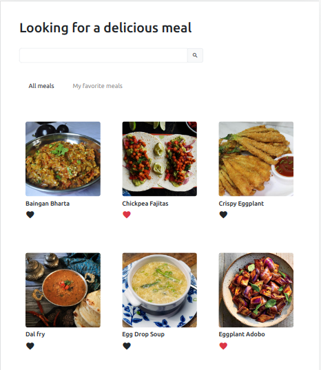
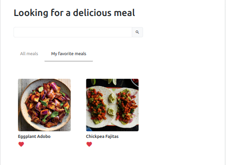
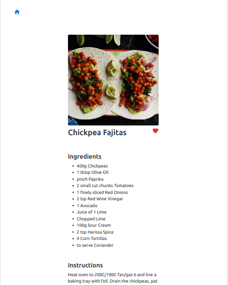

# App de receitas Vegetarianas e Veganas 

Essa aplicação está ainda em construção. Estou utilizando o framework **Vuejs** com estilização com classes do **Bootstrap** e a API pública <a href="https://www.themealdb.com/">TheMealDB</a>

 

 
 

## Para rodar a aplicação
 

> Rode o comando:

>> `npm install && npm run dev`

 
 

## O que falta fazer:
 

1. Resolver problema de reatividade dos estados
2. Implementar o campo de busca por nome e ingrediente da receita
3. ...

 
 

## Tela de Favoritos
 

 
 

## Tela de detalhe da receita
 

